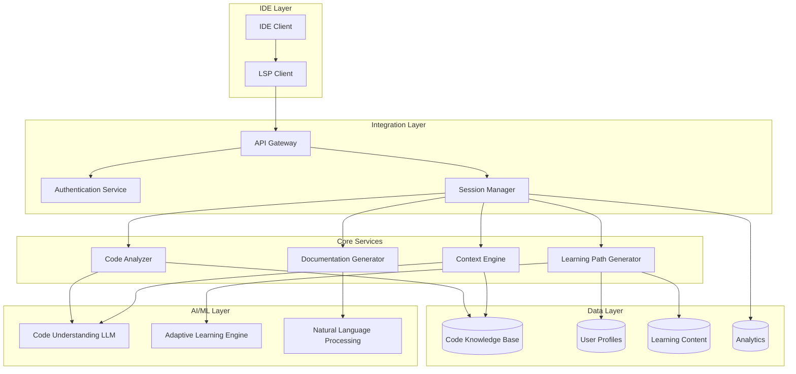
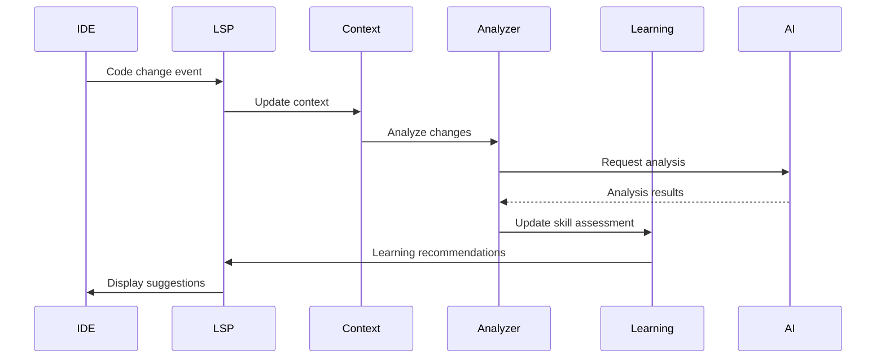

# Design Document: AI Learning Companion

## Overview

The AI Learning Companion is a sophisticated system that integrates with IDEs to provide context-aware learning assistance and productivity enhancement. The system leverages the Language Server Protocol (LSP) for IDE integration, combines real-time static analysis with machine learning for code understanding, and implements adaptive learning algorithms to create personalized developer experiences.

The architecture follows a modular, extensible design that separates concerns between IDE integration, code analysis, learning path generation, and documentation automation. This approach ensures scalability, maintainability, and the ability to support multiple IDEs and programming languages.

## Architecture

The system employs a layered architecture with clear separation of concerns:



### Key Architectural Decisions

1. **LSP-Based Integration**: Leverages the standardized Language Server Protocol for IDE communication, ensuring broad compatibility and reducing integration complexity.

2. **Microservices Architecture**: Core services are independently deployable and scalable, allowing for targeted optimization and maintenance.

3. **Hybrid Processing Model**: Combines local processing for privacy-sensitive operations with cloud-based AI services for complex analysis tasks.

4. **Event-Driven Communication**: Uses asynchronous messaging between services to maintain responsiveness and handle varying workloads.

## Components and Interfaces

### IDE Integration Layer

**LSP Server Implementation**
- Implements standard LSP methods (textDocument/hover, textDocument/completion, etc.)
- Extends LSP with custom methods for learning features
- Maintains persistent connection with IDE clients
- Handles real-time document synchronization

**Interface Definition**:
```typescript
interface LSPExtensions {
  // Standard LSP methods
  onHover(params: HoverParams): Promise<Hover>
  onCompletion(params: CompletionParams): Promise<CompletionList>
  
  // Custom learning methods
  onExplainCode(params: ExplainCodeParams): Promise<CodeExplanation>
  onRequestLearning(params: LearningRequestParams): Promise<LearningSession>
  onGenerateDocumentation(params: DocGenerationParams): Promise<Documentation>
}
```

### Context Engine

**Responsibilities**:
- Maintains real-time understanding of codebase structure
- Tracks developer focus and current work context
- Builds and updates semantic code representations
- Manages project-specific knowledge graphs

**Core Algorithms**:
- Abstract Syntax Tree (AST) analysis for code structure understanding
- Dependency graph construction for relationship mapping
- Incremental parsing for real-time updates
- Semantic similarity matching for context relevance

**Interface Definition**:
```typescript
interface ContextEngine {
  analyzeProject(projectPath: string): Promise<ProjectContext>
  updateContext(changes: CodeChange[]): Promise<void>
  getCurrentContext(): Promise<WorkContext>
  findRelatedCode(query: CodeQuery): Promise<CodeReference[]>
}
```

### Code Analyzer

**Analysis Capabilities**:
- Real-time static analysis for code quality and patterns
- Security vulnerability detection
- Performance bottleneck identification
- Best practice compliance checking
- Cross-language dependency analysis

**Machine Learning Integration**:
- Pattern recognition for code smells and anti-patterns
- Predictive analysis for potential bugs
- Style consistency enforcement
- Framework-specific best practice suggestions

**Interface Definition**:
```typescript
interface CodeAnalyzer {
  analyzeCode(code: string, language: string): Promise<AnalysisResult>
  suggestImprovements(context: CodeContext): Promise<Suggestion[]>
  detectPatterns(codebase: Codebase): Promise<Pattern[]>
  validateSecurity(code: string): Promise<SecurityIssue[]>
}
```

### Learning Path Generator

**Adaptive Learning Implementation**:
- Skill gap analysis based on code patterns and developer behavior
- Personalized content recommendation using collaborative filtering
- Progress tracking and competency modeling
- Dynamic difficulty adjustment based on performance

**Learning Algorithms**:
- Bayesian Knowledge Tracing for skill assessment
- Reinforcement Learning for optimal content sequencing
- Natural Language Processing for content personalization
- Clustering algorithms for peer comparison and recommendations

**Interface Definition**:
```typescript
interface LearningPathGenerator {
  generatePath(profile: DeveloperProfile, context: ProjectContext): Promise<LearningPath>
  updateProgress(sessionId: string, progress: LearningProgress): Promise<void>
  recommendContent(skills: SkillGap[], preferences: LearningPreferences): Promise<Content[]>
  assessSkillLevel(code: CodeSample[], domain: string): Promise<SkillAssessment>
}
```

### Documentation Generator

**Generation Strategies**:
- Template-based documentation for standard patterns
- AI-powered natural language generation for complex explanations
- Code-to-comment synthesis using transformer models
- Multi-format output (inline comments, markdown, API docs)

**Quality Assurance**:
- Consistency checking against existing documentation
- Accuracy validation through code analysis
- Style guide compliance enforcement
- Automated review and suggestion system

**Interface Definition**:
```typescript
interface DocumentationGenerator {
  generateInlineComments(code: string): Promise<CommentedCode>
  createAPIDocumentation(module: CodeModule): Promise<APIDoc>
  updateDocumentation(changes: CodeChange[]): Promise<DocumentationUpdate[]>
  validateDocumentation(doc: Documentation, code: string): Promise<ValidationResult>
}
```

## Data Models

### Core Data Structures

**Developer Profile**:
```typescript
interface DeveloperProfile {
  id: string
  skillLevels: Map<string, SkillLevel>
  learningPreferences: LearningPreferences
  workHistory: WorkSession[]
  achievements: Achievement[]
  currentGoals: LearningGoal[]
}

interface SkillLevel {
  domain: string
  proficiency: number // 0-1 scale
  confidence: number // 0-1 scale
  lastAssessed: Date
  evidenceCount: number
}
```

**Project Context**:
```typescript
interface ProjectContext {
  id: string
  structure: ProjectStructure
  dependencies: Dependency[]
  patterns: CodePattern[]
  conventions: CodingConvention[]
  complexity: ComplexityMetrics
}

interface ProjectStructure {
  files: FileNode[]
  modules: ModuleDefinition[]
  relationships: Relationship[]
  entryPoints: string[]
}
```

**Learning Session**:
```typescript
interface LearningSession {
  id: string
  developerId: string
  topic: string
  content: LearningContent[]
  interactions: Interaction[]
  startTime: Date
  duration: number
  outcomes: LearningOutcome[]
}

interface LearningContent {
  type: 'explanation' | 'exercise' | 'example' | 'quiz'
  content: string
  difficulty: number
  prerequisites: string[]
  estimatedTime: number
}
```

### Data Flow Architecture



## Error Handling

### Error Categories and Strategies

**Network and Connectivity Errors**:
- Implement exponential backoff for API calls
- Maintain local cache for offline functionality
- Graceful degradation when cloud services unavailable
- User notification with clear recovery instructions

**Analysis Errors**:
- Fallback to simpler analysis methods when complex analysis fails
- Partial results delivery when complete analysis impossible
- Error context preservation for debugging and improvement
- User feedback collection for error pattern identification

**Learning System Errors**:
- Default learning paths when personalization fails
- Content validation before delivery to prevent broken experiences
- Progress recovery mechanisms for interrupted sessions
- Alternative content sources when primary content unavailable

**Data Consistency Errors**:
- Conflict resolution strategies for concurrent modifications
- Data validation at multiple layers (input, processing, storage)
- Rollback mechanisms for failed operations
- Audit logging for error investigation and prevention

### Error Recovery Patterns

```typescript
interface ErrorHandler {
  handleNetworkError(error: NetworkError): Promise<RecoveryAction>
  handleAnalysisError(error: AnalysisError): Promise<FallbackResult>
  handleLearningError(error: LearningError): Promise<DefaultContent>
  logError(error: Error, context: ErrorContext): Promise<void>
}
```

## Testing Strategy

The testing approach combines comprehensive unit testing with property-based testing to ensure system reliability and correctness across diverse inputs and scenarios.

### Unit Testing Strategy

**Component-Level Testing**:
- Mock external dependencies (AI services, databases) for isolated testing
- Test specific examples and edge cases for each component
- Integration testing for component interactions
- Performance testing for real-time requirements

**Test Categories**:
- **API Contract Tests**: Verify LSP protocol compliance and custom extensions
- **Analysis Accuracy Tests**: Validate code analysis results against known patterns
- **Learning Algorithm Tests**: Test recommendation accuracy and personalization
- **Documentation Quality Tests**: Verify generated documentation accuracy and completeness

### Property-Based Testing Configuration

**Testing Framework**: Use Hypothesis (Python) or fast-check (TypeScript) for property-based testing
- **Minimum 100 iterations** per property test to ensure comprehensive coverage
- **Custom generators** for code structures, developer profiles, and learning content
- **Shrinking strategies** to find minimal failing examples for debugging

**Property Test Tagging**: Each property test includes a comment referencing the design document property:
```typescript
// Feature: ai-learning-companion, Property 1: Context updates preserve code relationships
```

Both unit tests and property tests are essential for comprehensive coverage - unit tests catch concrete bugs and verify specific behaviors, while property tests verify general correctness across all possible inputs.

## Correctness Properties

*A property is a characteristic or behavior that should hold true across all valid executions of a system—essentially, a formal statement about what the system should do. Properties serve as the bridge between human-readable specifications and machine-verifiable correctness guarantees.*

### Property 1: System Initialization and Connection Management
*For any* supported IDE startup event, the AI Learning Companion should initialize successfully and maintain stable connections, with automatic reconnection and user notification when connections are lost.
**Validates: Requirements 1.1, 1.5**

### Property 2: Real-Time Performance Requirements
*For any* code analysis or context update operation, the system should respond within specified time limits (500ms for context updates, 100ms for typical operations) without blocking the IDE interface.
**Validates: Requirements 1.2, 1.3, 10.2**

### Property 3: Cross-Platform Consistency
*For any* supported IDE platform, the same operations should produce functionally equivalent results and maintain consistent behavior across different environments.
**Validates: Requirements 1.4**

### Property 4: Context-Aware Code Analysis and Suggestions
*For any* code analysis or suggestion request, the system should consider the current codebase context, architecture, and conventions to provide relevant and appropriate recommendations.
**Validates: Requirements 2.2, 2.4, 5.3**

### Property 5: Contextual Explanations and Examples
*For any* code explanation request, the system should provide contextual information that includes relevant examples from the current project and step-by-step breakdowns for complex patterns.
**Validates: Requirements 2.1, 2.3, 2.5**

### Property 6: Documentation Generation and Synchronization
*For any* code creation or modification event, the documentation generator should create or update appropriate documentation that accurately reflects the code's purpose, follows project conventions, and maintains synchronization with code changes.
**Validates: Requirements 3.1, 3.2, 3.3, 3.4, 3.5**

### Property 7: Adaptive Learning and Profile Management
*For any* learning activity or skill assessment, the system should update developer profiles appropriately and adjust future recommendations based on demonstrated competency and learning outcomes.
**Validates: Requirements 4.2, 4.5, 7.4**

### Property 8: Knowledge Gap Identification and Learning Recommendations
*For any* codebase analysis or technology detection event, the learning path generator should identify relevant knowledge gaps and provide prioritized learning recommendations based on project needs and career goals.
**Validates: Requirements 4.1, 4.3, 4.4**

### Property 9: Project Context Understanding and Maintenance
*For any* project opening or code modification, the context engine should analyze and maintain accurate understanding of codebase structure, dependencies, relationships, and coding standards.
**Validates: Requirements 5.1, 5.2, 5.4**

### Property 10: Productivity Enhancement Features
*For any* repetitive pattern detection or similar task identification, the system should suggest appropriate automation opportunities, provide relevant templates, and help maintain work context across sessions.
**Validates: Requirements 6.1, 6.3, 6.5**

### Property 11: Proactive Issue Detection
*For any* code analysis operation, the system should identify potential bugs, security issues, and improvement opportunities before they become problems.
**Validates: Requirements 6.2**

### Property 12: Productivity Metrics and Tracking
*For any* development session, the system should accurately measure and report productivity metrics to help developers track their improvement over time.
**Validates: Requirements 6.4**

### Property 13: Interactive Learning Sessions
*For any* learning session request, the system should provide structured, interactive content with adaptive difficulty that responds to user understanding and provides appropriate exercises and examples.
**Validates: Requirements 7.1, 7.2, 7.3**

### Property 14: Learning Retention and Follow-up
*For any* completed learning session, the system should schedule appropriate follow-up sessions to reinforce learning and check retention based on the content and user performance.
**Validates: Requirements 7.5**

### Property 15: Multi-Language and Framework Support
*For any* supported programming language or popular framework, the system should provide consistent analysis capabilities, appropriate guidance, and language-specific documentation that follows established conventions.
**Validates: Requirements 8.1, 8.2, 8.5**

### Property 16: Polyglot Codebase Understanding
*For any* multi-language codebase, the context engine should understand cross-language interactions and relationships while gracefully handling unknown constructs.
**Validates: Requirements 8.3, 8.4**

### Property 17: Privacy and Security Compliance
*For any* code processing operation, the system should prioritize local processing when possible, encrypt data when cloud processing is required, respect opt-out preferences, and never transmit proprietary code without explicit consent.
**Validates: Requirements 9.1, 9.2, 9.3, 9.4**

### Property 18: Performance and Resource Management
*For any* system operation, the AI Learning Companion should meet performance requirements (30-second analysis for 1M+ lines of code, <500MB RAM usage), maintain IDE responsiveness through background processing, and scale resources based on available system capacity.
**Validates: Requirements 10.1, 10.3, 10.4, 10.5**